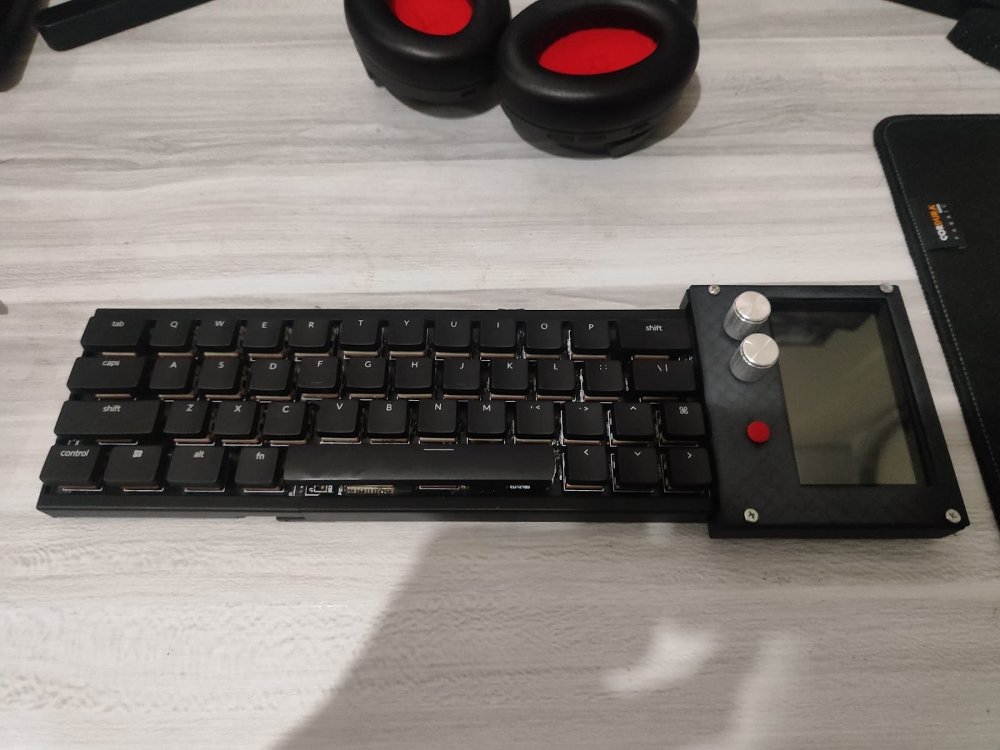
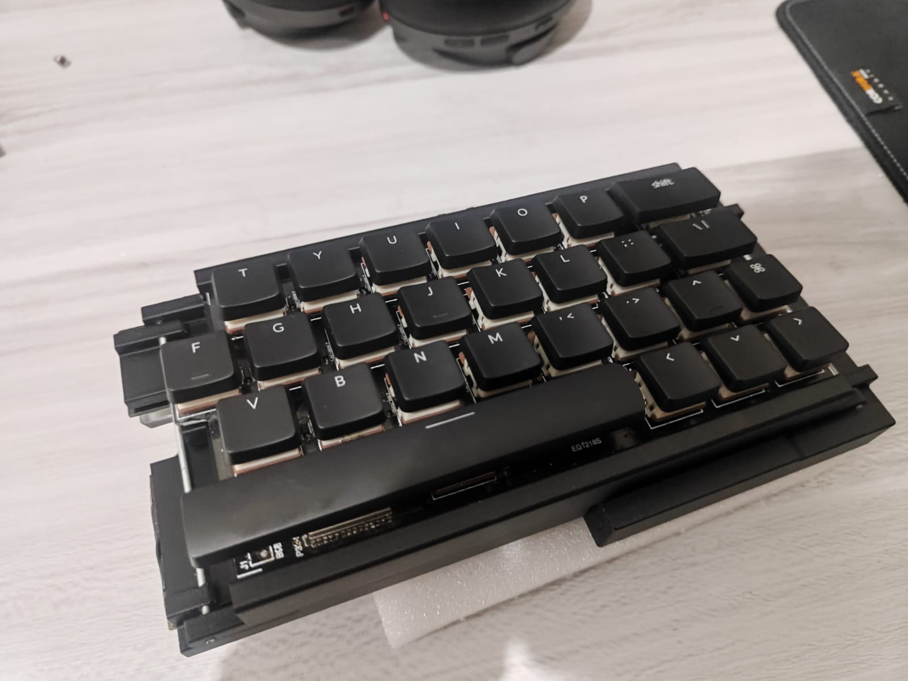
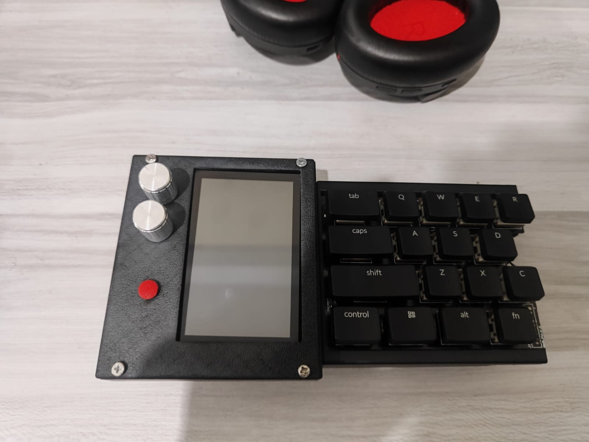

**Tri-fold wireless mechanical keyboard featuring a compact 40% layout, low-profile mechanical switches, a built-in capacitive touchscreen, volume control knob, and screen brightness control knob on the right side.**

